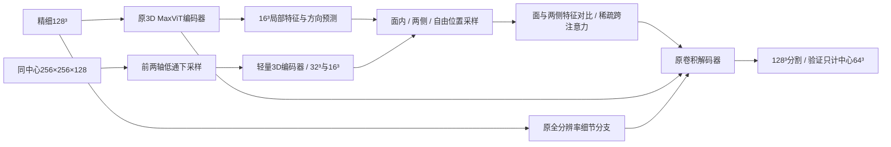

# SC-MaxViT3D：依据现有实验确定的下一轮模型设计

日期：2026-09-18。状态：**设计冻结建议；新网络尚未实现、未训练，不能声称优于基线。** 本轮完成了实验记录汇总和三个已有模型的完整验证诊断。没有启动新模型训练。本文件细化此前 Surface-guided Context MaxViT 候选，并依据验证分区形状调整大视野输入。

## 1. 这次结论依据什么

自动汇总 `runs/` 下51份CSV和13份JSON训练记录，共64个记录文件；其中包括空日志、smoke、续训和未完成试验，**不是64次完整独立实验**。见 `reports/final_model_design_20260918/experiment_inventory.csv`。各记录的配置、数据来源字段和文件哈希一并保留。

不能把所有目录里的 `test.json` 直接拼成排行榜：例如 `maxvit3d_par_{maxvit_tiny,unet_b30,unet_lg_b30}` 的文件现在是100个本地Wu风格数据的跨域结果，旧legacy测试输出则在 `logs/eval_legacy_par_*.log`。新清单将测试JSON标为需核验来源；CSV中的最高验证IoU也不必然对应当时按验证loss选择的checkpoint。

### 已有实验能支持的结论

|实验路线|当前证据|设计上的处理|
|旧数据、统一训练配方/算力的par系列|MaxViT最高记录验证IoU 0.6012，UNet 0.5580，UNet+attention 0.5830；分别记录227/238/223轮，最佳IoU轮也未必是按loss选择的测试轮|MaxViT在某些复杂分布上有优势，但不能推广为所有数据都最优|
|新版1000体|已核验测试快照UNet-L 0.83548，MaxViT 0.83259，hybrid 0.81182；预算56/200/36轮不同|不再以“必须在容易的合成集拉开大差距”为唯一目标；也不宣布数据已饱和|
|跨域复核|轴顺序纠正后，合成v2训练→官方Wu20：UNet 0.54811、MaxViT 0.43845、hybrid 0.56393|此前“MaxViT泛化必然最好”的叙述不成立；采用纠正后的审计结果|
|D2S＋profile/trace续训20轮|对照测试0.83254，组合0.83240；移除D2S对验证IoU影响约0.0000066|这条实现没有显示有效贡献，不能靠叠同类loss/微弱残差继续包装|
|scratch组合、compact、dynamic、DoubleBlock|分别存在未跑满、初始化/容量/解码器不同等情况；例如compact54轮验证0.79035，本身仍在增长|记录为未建立优势，不能把中途停止等同于充分证伪|
|Thebe v3旧context模型|15轮最好0.31910；代码只在同一个128³块内跨尺度融合，并替换了重解码器|并没有检验真实块外上下文；下轮保留基线解码器，改变可见证据范围|
|Thebe DoubleBlock、UNet-grid、VSSSAM|分别10/9/13轮最好0.24659/0.29544/0.32871；容量、预训练、是否full-res skip也不同|不照搬这些模块，也不声称同预算最终均失败|
|Thebe 2D MaxViT＋3D adapter|24轮；最佳16轮。完整诊断显示提高召回同时增加大量误报|主干使用目前排序能力更好的原3D MaxViT，不采用该adapter作起点|
|FG50抽样|MaxViT仅5轮、UNet仅2轮；MaxViT第5轮0.23318高于旧均匀抽样同轮0.19920|尚不能确认最终效果；首轮结构实验冻结原均匀抽样，FG50作为独立配方实验|
|半监督/少标注|10%标签监督试验仅10轮，非全标签同协议对照|本轮不把半监督、SSL、跨工区预训练混进架构实验|

旧Thebe协议下0.4197的记录不能与v3的0.3954直接排名。1000体跨真实Thebe的低分和Thebe→Wu的低分说明域差异明显，不能由此断言某一种预训练肯定有效或无效。

### 本轮新测：同一完整验证集、同一支持区域

三个checkpoint各重跑2433个64³核心块，共510,945,619个有效体素，正标签14,228,002个；不读取测试集。推理使用AMP；与训练时记录的FP32结果差异小于0.000001。AP为2001桶直方图近似，三个模型算法相同。

|已有模型|训练记录/所选轮|IoU@0.5|Precision|Recall|AP约|验证扫描最优阈值/IoU|
|---|---|---:|---:|---:|---:|---|
|UNet-L|100/47|0.376290|0.593921|0.506637|0.526544|0.15 / 0.381867|
|原3D MaxViT|100/47|0.395367|0.613075|0.526821|0.577482|0.15 / 0.404568|
|2D MaxViT＋adapter|24/16|0.377402|0.497433|0.609989|0.484386|0.55 / 0.378293|

阈值从0.05到0.95、间隔0.05；“最优阈值”在同一验证集上选择并报告，有选择乐观性，**不是新的独立测试结果**。它用于判断差距是否仅由阈值造成。

关键解释：

- 原MaxViT在现有这组Thebe checkpoint中同时优于UNet的P、R和AP，适合作主干。adapter仍未训练满，结论只限这些checkpoint。
- adapter相对MaxViT增加1,183,311个TP，同时增加4,037,848个FP，约每新增一个正确正体素伴随3.41个新增误报。不能只加召回权重。
- MaxViT仍漏掉47.32%的正标签体素，故也不能只收紧预测抑制误报。
- MaxViT约87.2%的FP落在“至少含一个正标签的64³核心块”，adapter约92.8%。这说明只筛除纯空块不够；**不能据此宣称FP就在断层表面附近**，需要后续距离分层和固定剖面确认。
- 128³上下文完整/被分区边界截断的分组中，MaxViT召回约0.625/0.462。两组地质内容不同，这只是观察，不能证明扩大视野必然有效。
- “误报”均是相对现有人工标签定义，未进行专家复核，不等于每个FP都是地质上的假断层。

数据及图：`reports/final_model_design_20260918/diagnostics/`、`diagnostic_summary.json`、`validation_diagnosis.png`。

## 2. 唯一主候选及可证伪假设

工作名 **SC-MaxViT3D（Surface-Contrast Context MaxViT）**，中文为“利用面内与面外特征对比的上下文MaxViT”。名称仅用于工程讨论，未完成新颖性穷尽检索。

研究假设：**相同大视野、相同采样预算下，沿局部候选薄面获取延续证据，再与该面的两侧特征对比，有机会比无方向的上下文聚合同时改善漏检和误报。**

这里有两个需要分别验证的环节：外部上下文是否有用；面与两侧的结构化采样是否比普通deformable更有用。现有统计尚未证明任何一个环节。不会从低召回直接推导出“大视野就是答案”。

这次改变信息来源和空间归纳方式，保留已经有效的3D MaxViT编码器与高分辨率卷积解码器，不把“大刀阔斧”理解成必须重写所有层。

## 3. 输入、网络形状和模块接口

### 3.1 使用适配现有划分的大视野

内部轴顺序为 `[sample, raw_axis1, section]`。

- 精细输入 `fine`: B×1×128×128×128，与原基线一致。
- 外围输入的原始覆盖范围 `context`: B×1×256×256×128，与fine同中心。
- 仅前两轴抗混叠下采样2倍，得到B×1×128×128×128；第三轴不下采样。
- context有效掩码同步变换；在本split之外一律无效。训练、验证、测试均不读取其他分区的振幅，更不读取其标签。

**为什么暂不使用256³：** v3验证section范围 `[900,1068)` 只有168点；256³会使所有验证上下文都在section方向缺失。本方案在section方向维持128，仅沿另外两轴扩展。它是有明确限制的三维各向异性上下文，不声称覆盖了周围26块或全方向两倍FOV。现有32点gap无需靠缩小gap换取上下文。

fine按当前有效振幅独立标准化；context采用同一fine的均值/方差，避免归一化差异成为隐含变量。抗混叠采用带掩码的归一化低通，不能让补零参加有效振幅统计。低通核、有效率阈值和边界处理在数据实现时统一冻结，所有双视野对照完全一致。旋转/翻转/振幅增强对fine/context在共同原始坐标中一致应用。

各向异性FOV还有一个实现要点：表中的shape/stride是**增强前**的原始轴约定。context先变换成128³，再与fine应用同一水平旋转/翻转，并同时变换坐标仿射矩阵；旋转轴1/2共90度时，context原始步距由(2,2,1)交换为(2,1,2)，两个feature尺度也相应交换。不能只旋转张量却保留旧坐标映射，或把旋转后的256×128×256强行当256×256×128。不同样本的仿射变换随batch一起传入采样模块。

### 3.2 主干和接入位置

保留 `models/maxvit3d.py::MaxViT3DUNet` 的：

- `full_res_skip=True, drop_path_rate=0.2, img_size=128`；
- 五级编码特征 `[64,64,128,256,512]`，空间大小 `[64³,32³,16³,8³,4³]`；
- 原 `dec4/dec3/dec2/dec1/dec0`，全分辨率16通道细节分支及最终分割头。

新增context轻量卷积编码器，建议通道24→48→96，空间64³→32³→16³，使用GN/GELU及深度可分离残差块。context32³与16³均投影到96通道，形成两个采样尺度。它们对应原始采样步距分别为 `(8,8,4)` 和 `(16,16,8)`。

**仅在fine16³、128通道的f2接入一次主模块。** Query投影到96维，4头×24维，4096个query全部参与。不能只处理原模型预测为前景或概率接近0.5的位置，否则高置信度漏检不会得到补充证据。

保留40,164,233参数基线，新增部分预算上限3M，总量目标不超过约43.2M，**这是设计预算，尚未实测参数/FLOPs/显存**。UNet-L只有9.64M，不能称参数匹配；论文需报告性能—实际耗时/显存/参数，补同上下文UNet和容量或计算匹配控制。先不追求同时压缩到9M，以免把架构问题与压缩损失混在一起。

## 4. 结构化采样的具体定义

### 4.1 候选面方向和面内位置

对每个query，用fine特征预测两个三维向量，通过稳定的正交化得到切向t1、t2和n=t1×t2。加入退化处理、非零初始基向量，记录方向头梯度。**没有法向GT时，这只是可学习的方向坐标架，不自动等同于真实断层法向。**

映射至原始采样坐标的query中心记为q，每个尺度取8个候选面内锚点：

`p_k = q + a_k*t1 + b_k*t2 + c_k*n`。

工程起点：a/b的跨度上限96个原始采样点、c的幅度上限8；初始位置覆盖16/32/64/96的不同半径。均为可学习有界偏移，不是硬性跨越断层端点的连通规则。另保留4个自由三维点，允许弯曲、交汇和局部方向不准时获取其他证据。

所有位置先在共同原始索引坐标中定义，再分别变换到context特征网格。不能在下采样后的各向异性网格里直接用同一欧氏方向，否则方向会扭曲。缺少可靠速度和物理间距时，不宣称这些距离/法向是物理尺度。

### 4.2 同时读取候选面两侧

每个面内锚点p还读取 `p_plus=p+delta*n`、`p_minus=p-delta*n`，delta初始工程范围8–16个原始采样点。两侧是**对照特征位置，不是自动认定的背景负样本**；临近断层可能也出现在其中。

若三处特征分别为h0、h+、h-，构造：

`h_mean = (h+ + h-)/2`

`h_contrast = h0 - h_mean`

`h_asym = abs(h+ - h-)`

用可学习投影处理 `[h0, h_contrast, h_asym]`，形成anchor token，再与4个自由位置token一起执行QK跨注意力。两侧交换不改变这些描述量，避免法向符号翻转导致不同结果。

这是**潜在特征层面的比较**，不是直接差分地震振幅，也不是强制连续层理均为背景。反射层本身也是面状，面内连续性不够区分断层；这一对比是否真正有利，需要等FOV/等预算控制及误报图检验。coarse尺度的两侧特征不能替代精细边界定位，边界仍由原full-res分支和解码器负责。

每query每尺度有8×3+4=28次位置读取，两个尺度共56次；点坐标跨4个attention头共享，各头学习自己的Q/K/V和权重。不是每头再复制56个独立坐标。使用分块 `grid_sample` 防止中间张量造成显存峰值。

无效点不作为零值背景参加softmax。只有中心点有效时可保留h0；任何一侧无效时关闭该anchor的contrast/asym分量，并附带有效状态，不伪造差分证据。全无效query回退本地特征。

### 4.3 融合和新增路径是否真起作用

`f2_new = f2 + W_out(attended_context)`，然后进入原dec3及后续解码器。W_out采用小幅非零初始化；**不加初始化为0的全局可学习门，也不使用预测前景概率作为硬门**。这不能保证路径最终有效，但避免首轮梯度被人为关闭。

训练必须记录：新增分支梯度范数、`norm(f2_new-f2)/norm(f2)`、有效点比例、落在fine外的采样比例、跨尺度注意力权重、面外偏移是否总触界。评估同时保存固定剖面的FP/FN和采样位置。

块外采样比例很低时不能宣称“大视野发挥作用”；移除分支结果几乎不变时不能宣称“几何建模已有贡献”。推理时置零块外只是敏感性检查，正式因果结论需重新训练不含外围证据的对照。

## 5. Loss与训练方案

首轮**沿用0.6 Dice＋0.4 Focal，alpha=0.75、gamma=2**，严格复用已有有效体素mask与归约方式。暂不增加中心线、法向、边界、persistent homology等loss。

理由是本轮要回答“网络的结构化上下文是否有用”。当前证据既有漏检也有误报，单纯增大召回权重可能重复adapter的P/R取舍。此前profile/trace已没有显示优势；三维断层是薄面及多分支网络，不能直接把血管中心线目标移植过来，也不能强制所有断层单连通无孔。

训练首轮继续Thebe spatial-v3：

- 原划分 train `[0,868)`、val `[900,1068)`、test `[1100,1803)`；当前测试已看过，应在论文如实说明，不能重新称blind test。
- 原均匀抽样2400窗口/epoch、global batch 8、100 epoch；4卡每卡2窗口为首选，先用context激活重计算控制显存。如果仍无法容纳而改为每卡1窗口、累积2次，则基线也需以相同microbatch复跑控制BN分组效应，不能只看global batch相同。
- 采用当前AdamW/warmup/cosine配方；结构结论首轮不引入ImageNet权重、synthetic权重、SSL或新强增广。
- 主模型与对照都从随机初始化训练；不要给新模型加载已训练MaxViT后与基线的早期曲线排名。对共享层可使用同一随机初始state，非相同结构层独立初始化。
- 保存共同窗口坐标及增强参数，确保不同模型同一步看相同fine输入；如果更换抽样逻辑则重新跑所有主对照。验证仍穷举2433核心，不用96块fast子集选择模型。
- checkpoint按完整验证IoU@0.5选择；同一checkpoint报告AP、P/R、阈值扫描。AP不是换checkpoint后的额外挑分。

FG50可继续作为单独对照，但只有两种基线均跑够后才能决定是否换统一配方。不得仅给新模型应用更好的抽样并将全部差异归因网络。

## 6. 最小开发顺序与消融

### 首先完成工程可行性与实现核验

1. 实现同中心双视野读取及有效mask；用坐标斜坡体核查轴顺序、中心对齐、旋转/翻转、两次下采样和grid_sample坐标约定。尤其核查PyTorch网格的x/y/z与数据D/H/W顺序。
2. 在支持域边界做哨兵值检查，确认context绝不跨train/val/test读数据；核查所有模型的有效核心计数不变。
3. 用人工平面、弯曲面和双面交汇的简单特征体检查方向/对侧交换、无效点回退、偏移梯度与非零残差；这是实现检查，不是地质性能实验。
4. 实测参数、单步训练峰值显存、吞吐和整体验证耗时；预算超限先缩context通道，不重写主干。100步可行性检查后才启动正式训练。

### 第一批架构比较

|编号|模型|回答什么|
|A|原UNet-L、原MaxViT，统一microbatch/抽样的基线|是否真正超过原任务基线|
|B|原MaxViT＋同FOV/同context编码器＋无方向的稀疏上下文|收益是否仅来自大视野和额外容量|
|C|完整SC-MaxViT|结构化面/两侧对比能否优于普通上下文|

B与C每query每尺度同为28次feature读取、相同两个尺度、同样投影维度与融合位置。可将B定义为8组三个独立自由点加4自由点，并使用相同token描述与attention，仅解除三点的面内/法向约束。这样比较聚焦于坐标结构；另补标准CoTr式普通28点聚合作通用控制，避免只使用人为较弱的B。

先运行B/C到30轮检查数值稳定性、分支是否被使用及同轮趋势，不以5–10轮或未过warmup的排名宣布最终失败；正常情况下两者都跑满100轮。若到50轮同轮IoU和AP都没有优势且学习已停滞，先定位采样/坐标/新增路径问题，不继续叠模块。只有100轮同协议结果才能与已完成基线构成主要结论。

### C有优势后再做机制消融

- 相同大视野的UNet＋简单卷积融合：控制额外信息本身。
- C去掉对比描述，仍读取相同56个位置，把特征普通聚合：检验面两侧对比。
- 固定坐标轴方向 vs 学习方向：检验方向自适应。
- 去掉自由点但维持总采样预算：检验曲面/交汇的处理。
- 同等容量额外卷积、标准自由deformable、同FOV比较；统计实际时间，不用“同epoch”冒充同算力。
- 3个训练种子；以连续空间区域为分组报告差异，不能把高度相关的几亿体素当独立样本计算极窄置信区间。单个工区内的重采样也不能替代跨工区验证。

若B>C或C≈B，只能支持上下文有效，不能宣称面引导有独立贡献。若C仅换阈值后胜出而AP无改进，要检查概率校准；若P明显下降但R升高，要检查是否重复adapter现象。

## 7. 怎样使用已有1000个合成体

保留既有800/100/100划分和所有已有结果，不为了拉开差距修改测试集。

已有体是独立128³，不能把不同体拼成连续256×256×128上下文。它们适合：核查平面/弯曲/交汇条件下采样与方向行为；继续单视野基线比较；可选的同待遇预训练。若用曲面文件生成方向辅助真值，必须先确认最终形变后的坐标与可见标签一致，旧PCA缓存不能冒充精确曲面法向。

要正式验证完整双视野模型的合成性能，需要生成连续大母体再裁fine/context，并按母体隔离划分；或者另立较小fine的双视野协议，对所有模型重新训练。两者都不能直接与旧128³协议的0.833比较。为尽快验证主假设，首轮先以Thebe为主，不把重新合成1000个大母体作为前置工作。

## 8. 预期与科研判断

目前不能科学预言新模型IoU，更不能承诺TGRS录用。可预先设定工程价值目标：在同协议下相对MaxViT 0.3954提升约2个百分点以上、AP相对0.5775同步提高，并在多个种子和同FOV控制下保持优势。0.415–0.435是**继续投入的目标区间，不是预测结果**。

例如P=0.62、R=0.57对应IoU约0.4224；这是指标关系 `IoU=PR/(P+R-PR)` 的算术例子，不是模型预测。比只把R升到0.61但让P掉到0.50更有价值。

若新增context已经显著增加I/O和计算、C却仅提高0.001–0.003，则应优先检查置信区间和复杂度收益，不急着写成主贡献。若完整同条件实验无优势，应如实放弃这条假设，不能继续调测试集或删掉困难区域。

能够形成论文贡献的目标是：**对三维断层薄面及其侧向背景进行结构化上下文检索，在同FOV和相近预算下改善精确率—召回率取舍。** 大视野、多尺度、Transformer、deformable这些词本身都不构成新颖性。

## 9. 文献定位与尚未排除的相近工作

- Large Perspective，TGRS2024，https://doi.org/10.1109/TGRS.2024.3470536 ：目标块与26邻块关系。原文已在本地thesis和提取文本中核对。本方案不是26邻块拼接；FOV大小不同，需明示，不能直接搬其F1当本项目IoU比较。
- CoTr，MICCAI2021，https://arxiv.org/abs/2103.03024 ：3D多尺度稀疏可变形采样已存在，作为主要机制对照。
- DSCNet，ICCV2023，https://openaccess.thecvf.com/content/ICCV2023/html/Qi_Dynamic_Snake_Convolution_Based_on_Topological_Geometric_Constraints_for_Tubular_ICCV_2023_paper.html ：借鉴对象几何约束采样的思路；管状中心线与薄曲面不同。
- MSDA-UNet，Marine Geoscience and Energy Resources2026，https://doi.org/10.1016/j.marger.2026.207664 ：地震断层已有多尺度可变形注意力＋轻量卷积；不是TGRS，不把普通MSDA称为本项目首创。
- DeepMedic，https://arxiv.org/abs/1603.05959 ：双分辨率上下文路径已有先例。

以上定位不等于穷尽新颖性检索。后续须专门排查surface-aware/deformable、差分注意力、成对采样和薄片结构分割工作，再决定最终标题与贡献措辞。

## 10. 本轮交付与下一动作

- 新实测：三个已有checkpoint的完整验证阈值扫描、AP、P/R、逐core错误和边界分组。
- 可追溯清单：64个训练记录文件及来源哈希。
- 新模型：本文及 `reports/final_model_design_20260918/design_spec.json` 中的设计，尚无新模型权重。
- 下一步实际开发：双视野dataset → 稀疏三点采样模块 → 坐标/梯度/显存核验 → B/C同条件训练。无需再花一轮更换主干或叠多个未经验证的loss。
