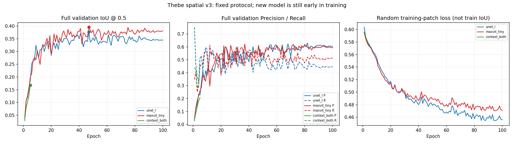

# Thebe 实验审计与下一步

[完整科研方案](../../docs/THEBE_NEXT_EXPERIMENTS_20260918.md)

[已有结果快照](results_snapshot.json) · [训练窗口抽样检查](sampler_audit.json) · [待执行实验计划](experiment_plan.json)

新增验证诊断脚本仅完成CPU指标检查，未运行GPU诊断；当前四卡训练未被修改。新训练候选尚未实现或启动。
